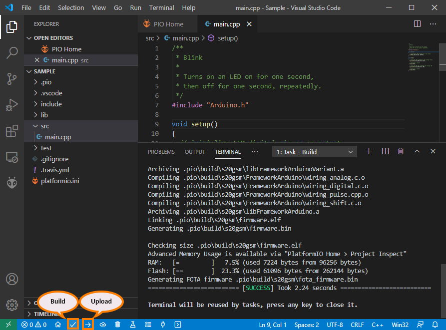
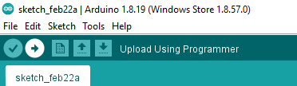
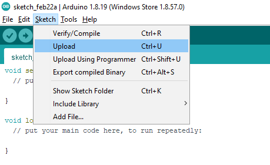

Flashing Application firmware
=============================

Upload Application via PlatformIO
---------------------------------

Click on the upload icon in bottom toolbar as shown in picture

Upload Application via Arduino
------------------------------

Directly click on upload button in toolbar as shown

Alternatively from Menu bar, go to Sketch -> Upload

Flashing RDA8955 firmware
^^^^^^^^^^^^^^^^^^^^^^^^^

IDE flashing is not available for RDA8955 chipset, Please use tools
mentioned in :doc:`core flashing <core>` section for flashing application
firmware.
