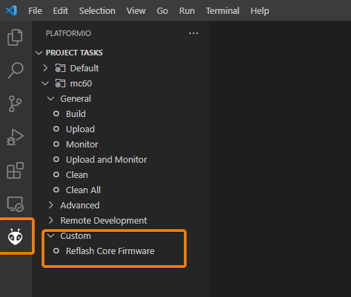
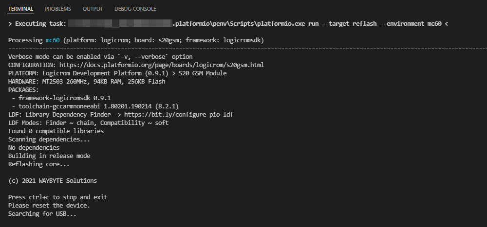
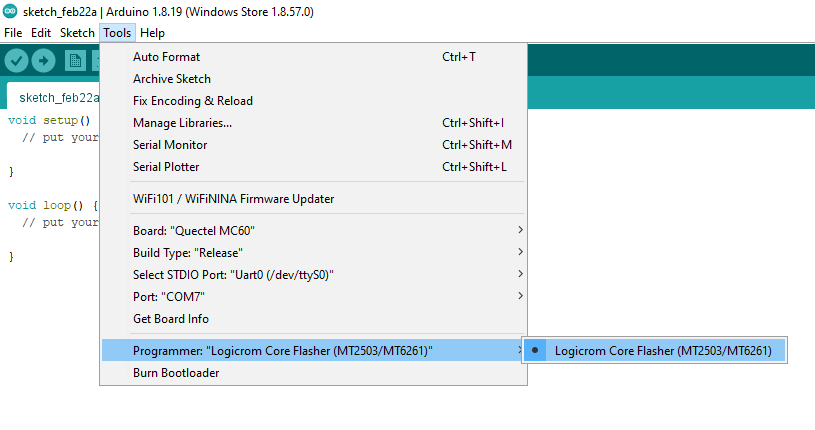
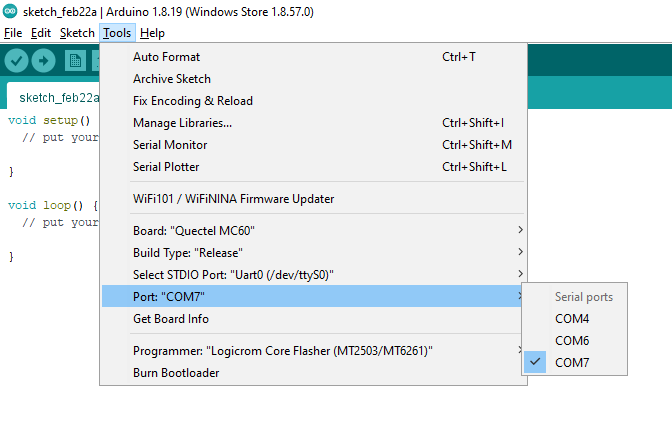
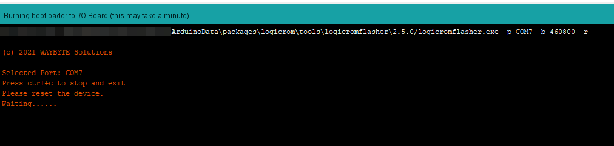

Firmware Flashing Guide
=======================

Core and application firmware flashing is supported on both PlatformIO and Arduino IDE.

Flashing Application firmware
-----------------------------

Upload Application via PlatformIO
^^^^^^^^^^^^^^^^^^^^^^^^^^^^^^^^^

Click on the upload icon in bottom toolbar as shown in picture

.. image:: ../_static/platformio-ide-code-build.png

Upload Application via Arduino
^^^^^^^^^^^^^^^^^^^^^^^^^^^^^^

Directly click on upload button in toolbar as shown

.. image:: ../_static/arduino-ide-flash-upload.png

Alternatively from Menu bar, go to Sketch -> Upload

.. image:: ../_static/arduino-ide-flash-menu.png

Core Firmware Re-flash
----------------------

Currently core re-flashing of GSM devices is possible and it's only supported on windows platform due to vendor limitation.

Flashing Core via PlatformIO
^^^^^^^^^^^^^^^^^^^^^^^^^^^^

1. Open project tasks by clicking PlatformIO icon from left sidebar
2. Under custom tasks, click "Reflash Core Firmware"

3. Core flashing will start, check progress in terminal windows

Flashing Core via Arduino
^^^^^^^^^^^^^^^^^^^^^^^^^

1. Select Programmer from Tools -> Programmer -> Logicrom Core Flasher (MT2503/MT6261)

2. Select device COM port under Tools -> Port

3. Click Tools -> Burn Bootloader to start flashing. Check flash progress in the output console

Flashing Issues
---------------

If you face any problem during application or core flashing, Please open new issue here:

https://github.com/waybyte/platform-logicrom/issues

