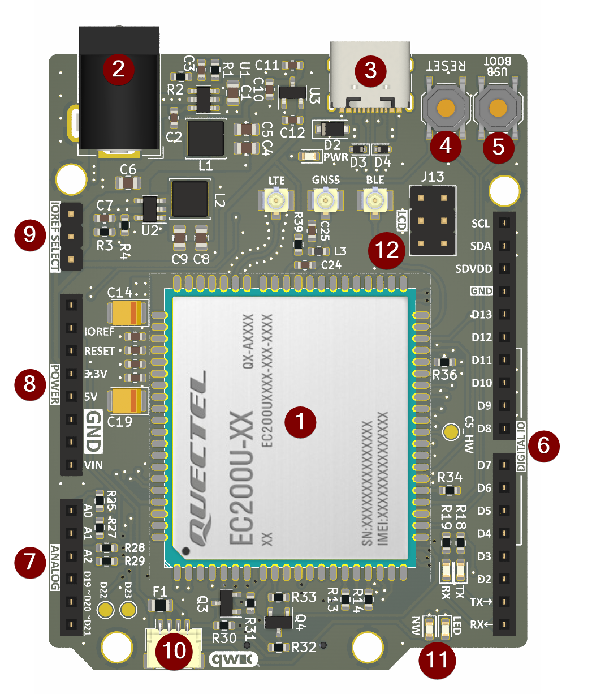
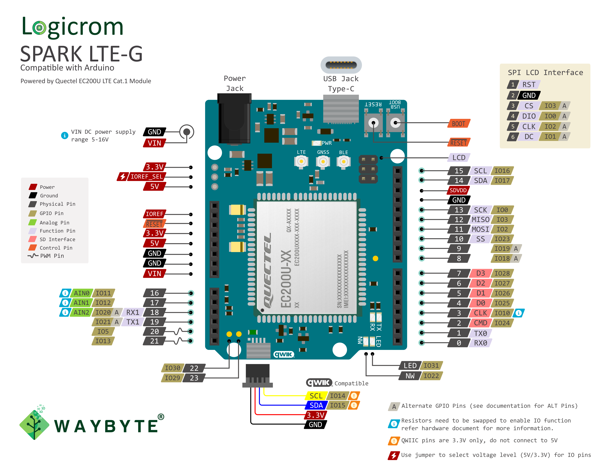

Hardware Reference Guide
========================

.. note:: Please refer to Hardware reference manual provided by respective module vendors for Module documentation.

Logicrom Spark LTE-G
--------------------

**Logicrom Spark LTE-G** stands as an Arduino-compatible development board, meticulously
crafted by Waybyte Solutions. Engineered to mirror the form factor of Arduino UNO R3/R4
boards, it offers the added convenience of selectable IO voltage levels (defaulting to 5V,
with the option to switch to 3.3V). This shared design simplifies the process of directly
interfacing existing Arduino shields with the Logicrom Spark board, expediting prototyping
and development.

The **Logicrom Spark LTE-G** board hosts an impressive suite of features, including:

- Up to 30 GPIOs
- 3 ADC interfaces
- 2 PWM-capable IOs
- 2 UARTs
- 1 SPI LCD interface
- 1 SPI interface
- 2 I2C ports, one of which is Qwiic compatible
- USB 2.0 slave functionality, supporting 2 virtual serial ports for application use
- 1 SD interface
- 1 USIM slot
- On-chip GNSS
- Bluetooth 4.2

Boasting a developer-friendly design, the **Logicrom Spark** facilitates programming with ease,
whether through the Arduino framework or the Logicrom OpenCPU SDK. Whether you're an experienced product
engineer or an enthusiastic hobbyist, the **Logicrom Spark** emerges as the perfect choice for
your prototyping and development endeavors.

Board Description
-----------------

.. centered:: *Logicrom Spark LTE-G (LTE Cat.1 with GNSS) compatible with Arduino*

.. list-table::
    :widths: 2 25 73
    :header-rows: 1

    * - #
      - Key Component
      - Description
    * - 1
      - EC200U-CN-AA
      - | A module with UIS8910DM at its core, manufactured by Quectel. For more information,
        | see `EC200U Hardware Reference Manual`_.
    * - 2
      - Power Jack
      - DC power supply, range 5V - 16V.
    * - 3
      - Type-C USB port
      - USB interface for communication and firmware flashing, Power supply for the board.
    * - 4
      - Reset
      - Module reset button.
    * - 5
      - USB Boot
      - Force USB boot button, for emergency flashing.
    * - 6
      - I/O Connector 1
      - | Most of the pins on the EC200U module are broken out to the pin headers on the board.
        | You can program EC200U to enable multiple functions such as PWM, ADC, I2C, SPI, etc.
    * - 7
      - I/O Connector 2
      - Analog and PWM pins are available on this connector.
    * - 8
      - Power Connector
      - Power input and output connector with reset control.
    * - 9
      - IO Level select
      - To select IO level between 5V (default) and 3.3V.
    * - 10
      - Qwiic I2C Connector
      - I2C port compatible with Qwiic ecosystem.
    * - 11
      - LEDs
      - LED indicator for Network, RX/TX activity and Arduino LED_BUILTIN
    * - 12
      - LCD Interface
      - SPI LCD interface for resolution upto 320x240px.

Power Supply Options
--------------------

There are three mutually exclusive ways to provide power to the board:

* USB port, default power supply
* Power Jack or VIN on power pin header
* 5V from power pin header

Header Block
------------

There are 5 broadly categorized header blocks on Logicrom Spark board. Following are the details of each header block group.

Digital IO Header
^^^^^^^^^^^^^^^^^
=====  ==========  ===============================================
Name   Type [1]_   Function [2]_
=====  ==========  ===============================================
TX     O           UART0_TX
RX     I           UART0_RX
D2     I/O         GPIO24, SD_CMD
D3     I/O         GPIO10, SD_CLK [3]_
D4     I/O         GPIO25, SD_D0
D5     I/O         GPIO26, SD_D1
D6     I/O         GPIO27, SD_D2
D7     I/O         GPIO28, SD_D3
D8     I/O         GPIO18_ALT
D9     I/O         GPIO19_ALT
D10    I/O         GPIO23, SPI_SS [4]_
D11    I/O         GPIO2, SPI_MOSI
D12    I/O         GPIO3, SPI_MISO
D13    I/O         GPIO0, SPI_CLK
GND    G           Ground
SDVDD  P           SD Card power
SDA    I/O         GPIO17, I2C0_SDA
SCL    I/O         GPIO11, I2C0_SCL
=====  ==========  ===============================================

Analog IO Header
^^^^^^^^^^^^^^^^
=====  ==========  ===============================================
Name   Type [1]_   Function [2]_
=====  ==========  ===============================================
A0     AI/O        AIN0, IO11 [5]_
A1     AI/O        AIN1, IO12 [5]_
A2     AI/O        AIN2, IO20_ALT [5]_, UART1_RX
D19    I/O         GPIO21_ALT, UART1_TX
D20~   I/O         GPIO5, PWM_CH0
D21~   I/O         GPIO13, PWM_CH1
=====  ==========  ===============================================

Power Header
^^^^^^^^^^^^
=====  ==========  ===============================================
Name   Type [1]_   Function
=====  ==========  ===============================================
NC     \-          Not connected
VDD    P           IO VDD level (output)
RST    I           Reset Input
3V3    P           3.3V power output, 200mA max
5V     P           5V power output, 2A max when on external supply
VIN    P           VCC input 5-16V, 1A min
=====  ==========  ===============================================

IOREF Select
^^^^^^^^^^^^
===  =====  ==========  ===============================================
No.  Name   Type [1]_   Function
===  =====  ==========  ===============================================
1    3V3    P           3.3V
2    VDD    P           IO VDD level
3    5V     P           5V
===  =====  ==========  ===============================================

.. note:: Pin 2-3 of IOREF is connected via jumper to select 5V as default IO VDD level.

LCD Header
^^^^^^^^^^
===  =====  ==========  ===============================================
No.  Name   Type [1]_   Function [2]_
===  =====  ==========  ===============================================
1    RST    O           LCD Reset control
2    GND    G           Ground
3    CS     I/O         LCD Chip select, GPIO3_ALT
4    DIO    I/O         LCD Data IO, GPIO0_ALT
5    CLK    I/O         LCD Clock, GPIO2_ALT
6    DC     I/O         LCD Data/Command select, GPIO1_ALT
===  =====  ==========  ===============================================

.. [1] P: Power supply; I: Input; O: Output; A: Analog.
.. [2] GPIO pins as per Logicrom OpenCPU SDK
.. [3] SD_CLK line is not a mux function of IO, It can be enabled by resistor swapping. See Hardware schematic for more information.
.. [4] SPI_SS is not Hardware function of this IO. Use GPIO to control this line to use as SPI CS. If hardware chipselect line is required, use CS_HW test point on board. Refer Hardware schematic for more information.
.. [5] Analog input is not a multiplexed IO pin. To enable IO function resistor swapping to be done. Hardware schematic for more information.

Pin Layout
^^^^^^^^^^^

Start Application Development
-----------------------------

Before powering up your board, please make sure that the board is in good condition with no obvious signs of damage.
Create your project selecting "Logicrom Spark LTE-G" as your board in platformIO. Follow the steps for preferred
framework.

Logicrom OpenCPU SDK
^^^^^^^^^^^^^^^^^^^^

To start your development with Logicrom OpenCPU SDK, follow the quick start guide :doc:`../quick_start/logicrom`.

Arduino
^^^^^^^

To run your first Arduino application on your Logicrom Spark board, follow the quick start guide  :doc:`../quick_start/arduino`.

Related Documents
-----------------

* `Logicrom Spark LTE-G schematic <https://waybyte.in/files/logicrom_spark_r1_sch.pdf>`_ (PDF)
* `EC200U Hardware Reference Manual <https://waybyte.in/files/Quectel_EC200U_Series_Hardware_Design_V1.2.pdf>`_ (PDF)
