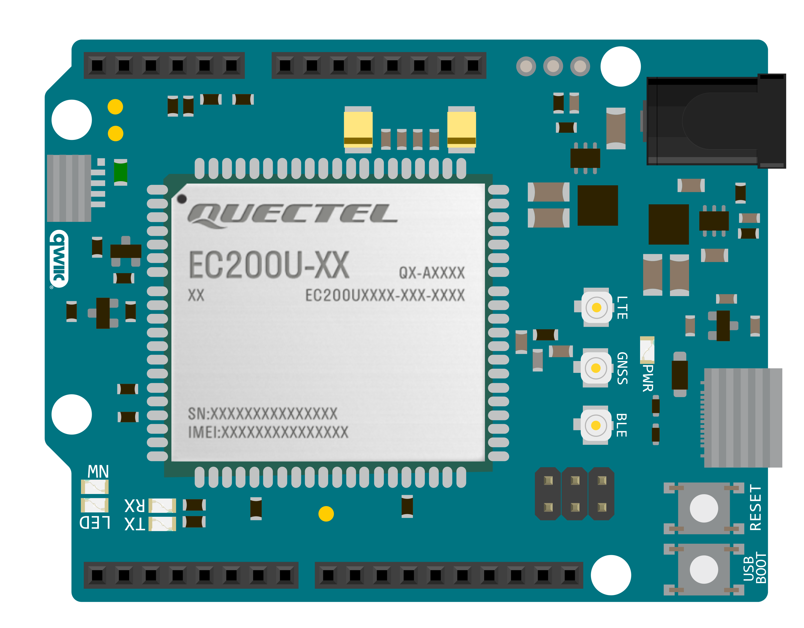

Quick Start Guide
=================

This document is intended to guide users in preparing their hardware and setting up the
software development environment for application development on 4G LTE, GSM, and NB-IoT
modules using the Logicrom software development kit.

Logicrom Spark
--------------

The Logicrom Spark boards come pre-installed with Logicrom core firmware, ready to kickstart
your project development.

If you are using the :doc:`Logicrom Spark LTE-G<hw/index>` board, you can directly proceed to
the section on `Setting up the Development Environment`_.

Custom Hardware/Module Board
----------------------------

Check :doc:`here <../index>` to verify if your module is supported by the Logicrom OpenCPU SDK. To request
the addition of a new module, refer to the section on `Need Help?`_

This section is divided into three parts:

1. Prepare Your Hardware for the SDK: `Flash Logicrom Core Firmware`_
2. Activate Logicrom Core: `Activate Logicrom Core`_
3. Setting up the IDE: `Setting up the Development Environment`_

Flash Logicrom Core Firmware
^^^^^^^^^^^^^^^^^^^^^^^^^^^^

Download the core firmware for the selected module from our GitHub page: https://github.com/waybyte/logicrom_core

Refer to the :doc:`core flashing guide <flash/core>` for instructions on flashing the core firmware
onto the device.

Activate Logicrom Core
^^^^^^^^^^^^^^^^^^^^^^

To run applications on the Logicrom OpenCPU SDK, the device needs to be activated. A personal license
is free to use without any feature restrictions. Follow these steps to acquire a license for
your device:

1. Register an account on Waybyte (https://waybyte.in/register).
2. Click on "Register Free Device" from the left menu
3. Enter device details (IMEI and module type) and register
4. Insert a valid SIM card into the device
5. Power on the device; it should acquire the license. If not, run the "getlic" command from
   the device console port (USB Port 0 or main UART) to try again.
6. If the APN needs to be configured, set the APN using the following command:
   
   ``apn=<access point name>``

   For example: ``apn=mynetapn``
   
   After setting the APN, reboot the device or run the "getlic" command as mentioned in step 5.
7. If activation is successful, the device will respond with the serial number URC text:
   
   ``"+SER: 123456789012345"``

8. Reboot the device and verify using the "devinfo" command. The UID must be set to the new serial number.

Setting up the Development Environment
--------------------------------------

Setup IDE
^^^^^^^^^

Logicrom is supported by both the PlatformIO IDE and Arduino IDE. Users can choose the IDE of their
preference, though our recommendation is to use PlatformIO.

Follow the installation guide to set up the IDE.

.. toctree::
   :maxdepth: 1

   Installing Logicrom on Arduino IDE <quick_start/setup_arduino>
   Installing Logicrom on PlatformIO <quick_start/setup_platformio>

Building & Flashing Application
-------------------------------

.. toctree::
   :maxdepth: 1

   Creating a Project in PlatformIO using Logicrom OpenCPU SDK <quick_start/logicrom>
   Creating a Project in PlatformIO using Arduino Framework <quick_start/arduino>

Refer to the :doc:`application flashing guide <flash/application>` for uploadingthe application
onto the device.

Need Help?
----------

Need assistance with installation or want to request the addition of a new module? Feel free to
reach out to us via email at support[at]waybyte.in or post your queries on our GitHub page
at https://github.com/waybyte/platform-logicrom/issues

