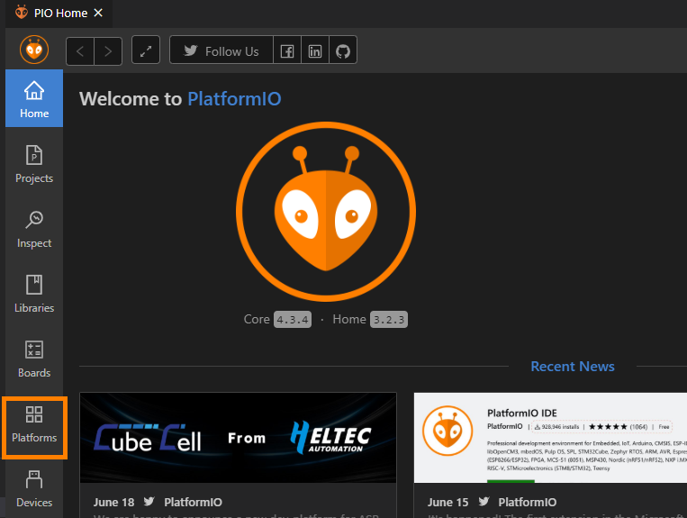
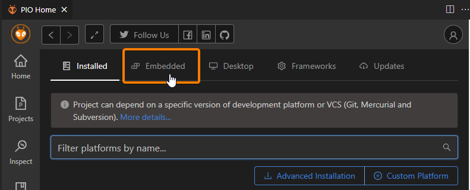
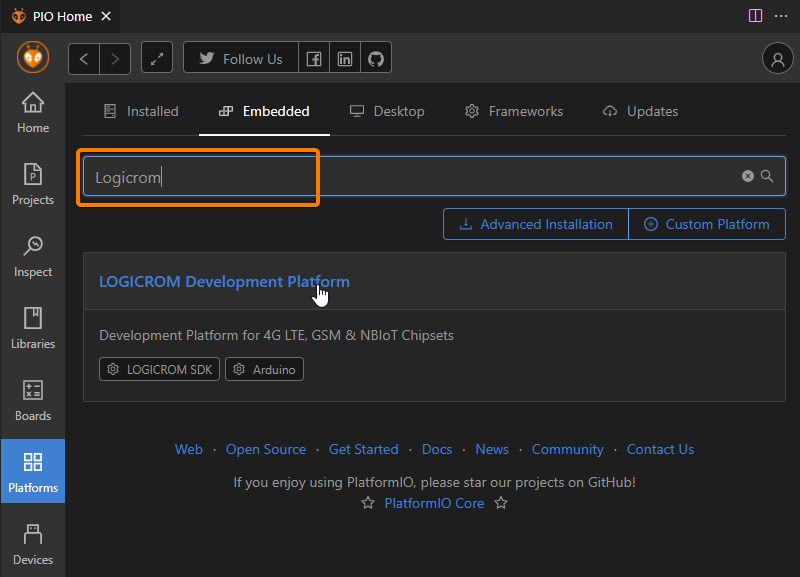
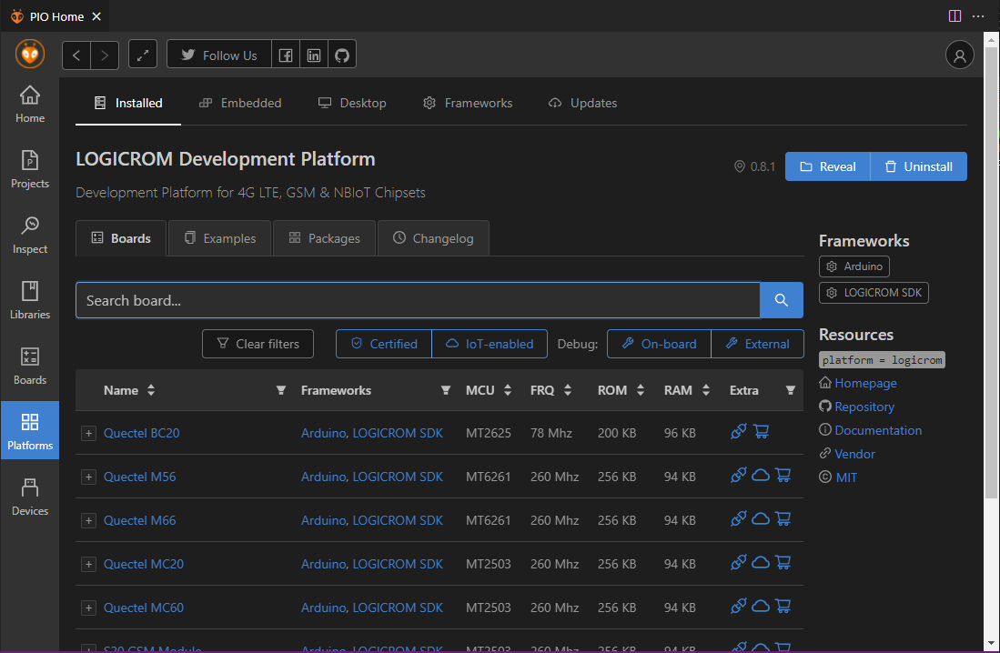
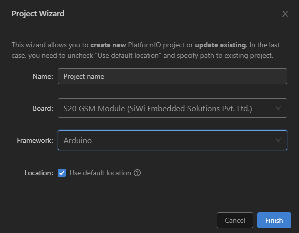
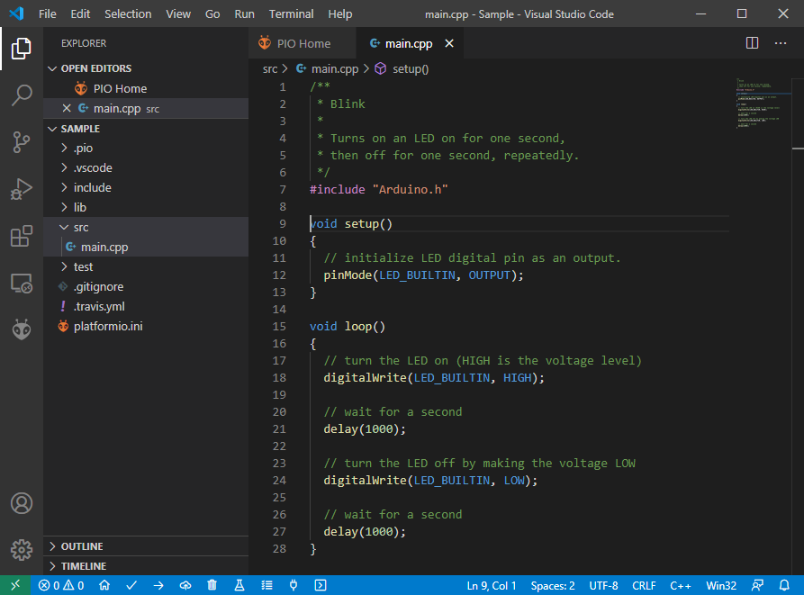

*****************
Quick Start Guide
*****************

This document is intended to help users setup software development environment
for application development on 4G LTE, GSM and NB-IoT modules using LOGICROM
software development kit.

Setting up Development Environment
==================================

LOGICROM is supported by both PlatformIO IDE and Arduino IDE with Arduino wiring
support. Users can select IDE of their choice though our recommendation is to
go with PlatformIO.

PlatformIO IDE
==============

PlatformIO IDE is the next-generation integrated development environment for IoT.
More information about PlatformIO.

- `What is PlatformIO? <https://docs.platformio.org/en/latest/what-is-platformio.html>`_
- `About PlatformIO IDE <https://docs.platformio.org/en/latest/integration/ide/pioide.html>`_
- `Installing PlatformIO IDE for VSCode <https://docs.platformio.org/en/latest/integration/ide/vscode.html#installation>`_

Quick Installation steps for PlatformIO IDE
-------------------------------------------

1. `Download <https://code.visualstudio.com/>`_ and install official Microsoft Visual Studio Code. PlatformIO IDE is built on top of it.
2. **Open** VSCode Package Manager.
3. **Search** for the official platformio ide `extension <https://marketplace.visualstudio.com/items?itemName=platformio.platformio-ide>`_
4. *Install** PlatformIO IDE.

.. image:: ../_static/platformio-ide-vscode-pkg-installer.png

Installing LOGICROM Platform
----------------------------

1. Click on "PlatformIO Home" button on the bottom `PlatformIO Toolbar <https://docs.platformio.org/en/latest/integration/ide/vscode.html#ide-vscode-toolbar>`_

.. image:: ../_static/platformio-ide-vscode-welcome.png

2. Click on "Platforms" Button on the left sidebar of PlatformIO Home.

3. On Platforms Page, Click on "Embedded" button on the top toolbar.

4. Type "Logicrom" in the search box as shown, and click on "LOGICROM Development Platform".
   

5. On Logicrom Platform page, Click install button as shown.

You have successfully installed LOGICROM Platform

Setting Up the Project
----------------------

1. Go to "Projects" from PlatformIO Home and click "Create New Project" button.

.. image:: ../_static/platformio-ide-new-project.png

2. Configure Project settings:
   * Name: Name of project
   * Board: Select board from dropdown
   * Framework: Select from "Arduino" or "LogicromSDK" frameworks
   * Location: To use custom location, un-check "Use default location" and select project folder.
   * Click finish to create project.

3. Open ``main.cpp`` file form ``src`` folder and replace its contents with

.. code-block:: cpp

    /**
     * Blink
     *
     * Turns on an LED on for one second,
     * then off for one second, repeatedly.
     */
    #include "Arduino.h"

    void setup()
    {
      // initialize LED digital pin as an output.
      pinMode(LED_BUILTIN, OUTPUT);
    }

    void loop()
    {
      // turn the LED on (HIGH is the voltage level)
      digitalWrite(LED_BUILTIN, HIGH);

      // wait for a second
      delay(1000);

      // turn the LED off by making the voltage LOW
      digitalWrite(LED_BUILTIN, LOW);

       // wait for a second
      delay(1000);
    }

4. Build your project with ctrl+alt+b hotkey (see all Key Bindings in “User Guide” section below)
   or using “Build” button on the PlatformIO Toolbar.
   
.. image:: ../_static/platformio-ide-code-build.png

Serial Port Configuration
-------------------------

To setup serial port for upload and monitor, You can edit project configuration file ``platform.ini``
in project source tree.

.. code-block:: ini

   [env:s20gsm]
   platform = logicrom
   board = s20gsm
   framework = arduino
   
   ; Upload Port
   upload_port = COM1
   upload_speed = 921600 ; Default is 460800
   
   ; Monitor Port
   monitor_port = COM2
   monitor_speed = 115200
   
Setting Debug Build Environment
-------------------------------

User can add extra configuration in ``platform.ini`` to build project against
logicromsdk debug library.

.. code-block:: ini

   ; Debug env
   [env:s20gsm_debug] ; Env Name
   platform = logicrom
   board = s20gsm
   framework = arduino
   
   build_type = debug ; Build Type
   debug_build_flags = -Os -g2 ; Extra flags for build

Each environment in ``platform.ini`` file has its own task list which can be executed from "Project Task"
list as shown below.

.. image:: ../_static/platformio-ide-project-tasks.png

User can add as many configuration as needed, with different boards etc using same source.

For advanced configuration settings of ``platform.ini`` Please refer official documentation of PlatformIO:
https://docs.platformio.org/en/latest/projectconf/index.html#projectconf

Arduino IDE
===========

The open-source Arduino Software (IDE) makes it easy to write code and upload it to the board.
More to read about Arduino IDE:

`Arduino IDE <https://www.arduino.cc/en/main/software>`_

Installing LOGICROM Platform
----------------------------

1. Download and Install Arduino IDE from `ardino website <https://www.arduino.cc/>`_
2. Open Arduino IDE, Go to **File** > **Preferences**
3. Add LOGICROM Boards URL to *Additional Board Manager URLs* and click OK.
   ``https://waybyte.github.io/package_logicrom_index.json``
   
.. image:: ../_static/arduino-ide-prefs.png

4. Go to **Tools** > **Board** > **Board Manager**
5. In search box, type "logicrom"
6. Click Install button for *LOGICROM Arduino Boards*.
7. Select your gsm board from board manager under "LOGICROM Arduino"

.. image:: ../_static/arduino-ide-board-manager.png

Support
=======

Need help in installation or setup?
or Post issues on our gitup page @ https://github.com/waybyte/platform-logicrom/issues
