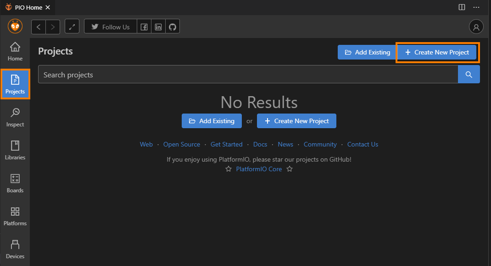
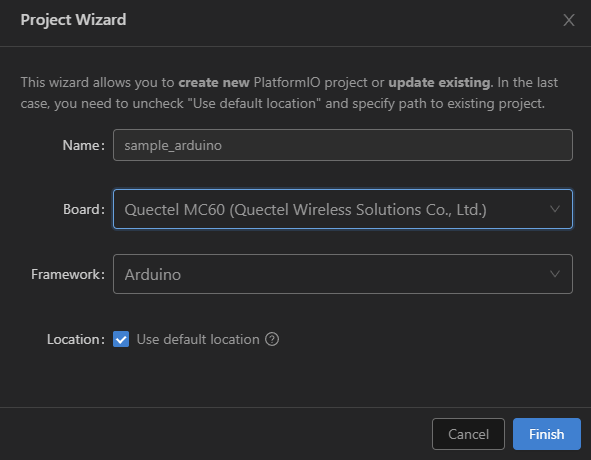
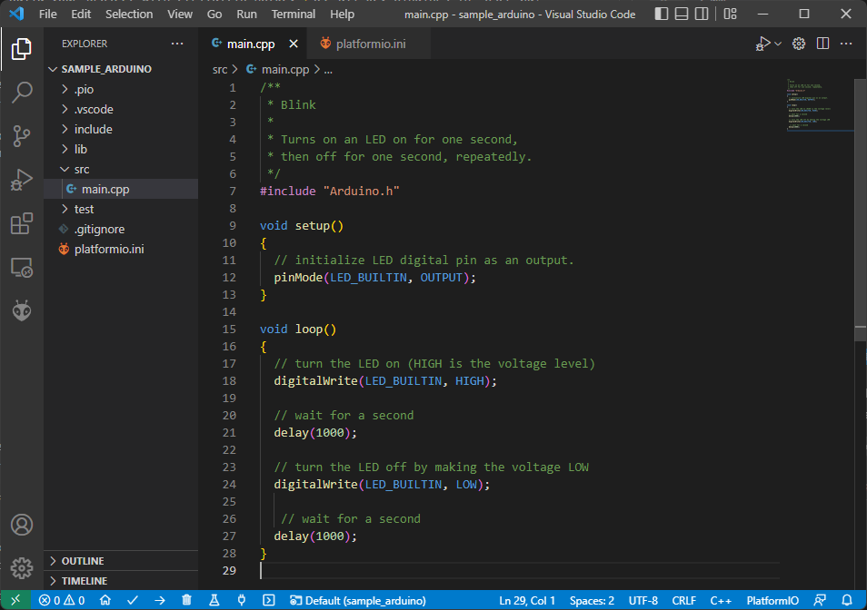
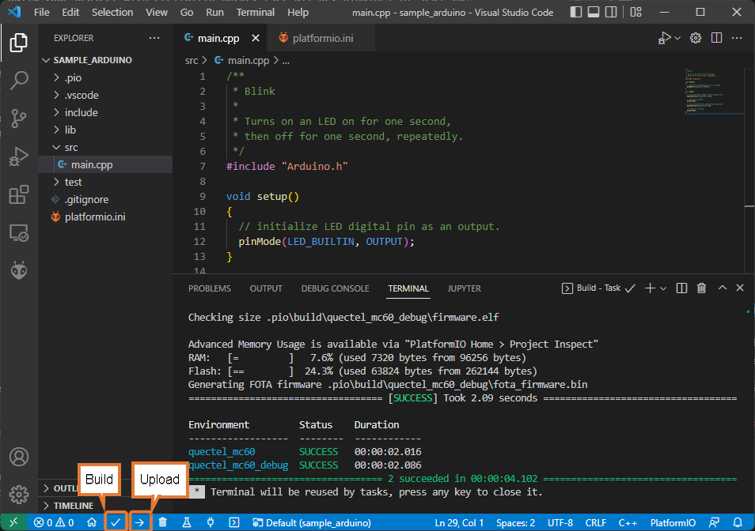
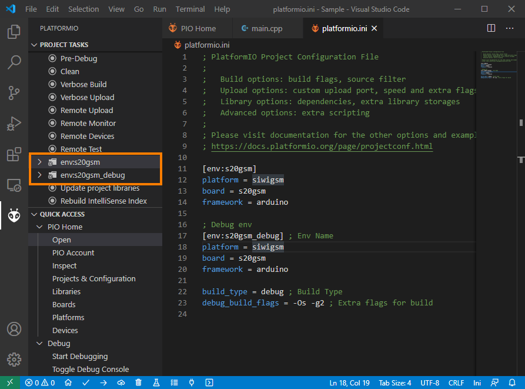

Creating Project in PlatformIO using Arduino Framework
******************************************************

Setting Up the Project
----------------------

1. Go to "Projects" from PlatformIO Home and click "Create New Project" button.

2. Configure Project settings:
   * Name: Name of project
   * Board: Select board from dropdown
   * Framework: Select from "Arduino" frameworks
   * Location: To use custom location, un-check "Use default location" and select project folder.
   * Click finish to create project.

3. Open ``main.cpp`` file form ``src`` folder and replace its contents with

.. code-block:: cpp

    /**
     * Blink
     *
     * Turns on an LED on for one second,
     * then off for one second, repeatedly.
     */
    #include "Arduino.h"

    void setup()
    {
      // initialize LED digital pin as an output.
      pinMode(LED_BUILTIN, OUTPUT);
    }

    void loop()
    {
      // turn the LED on (HIGH is the voltage level)
      digitalWrite(LED_BUILTIN, HIGH);

      // wait for a second
      delay(1000);

      // turn the LED off by making the voltage LOW
      digitalWrite(LED_BUILTIN, LOW);

       // wait for a second
      delay(1000);
    }

4. Build your project with ctrl+alt+b hotkey (see all Key Bindings in “User Guide” section below)
   or using “Build” button on the PlatformIO Toolbar.
   

Serial Port Configuration
-------------------------

To setup serial port for upload and monitor, You can edit project configuration file ``platform.ini``
in project source tree.

.. code-block:: ini

   [env:quectel_mc60]
   platform = logicrom
   board = quectelmc60
   framework = arduino
   
   ; Upload Port
   upload_port = COM1
   upload_speed = 921600 ; Default is 460800
   
   ; Monitor Port
   monitor_port = COM2
   monitor_speed = 115200
   
Setting Debug Build Environment
-------------------------------

User can add extra configuration in ``platform.ini`` to build project against
logicromsdk debug library.

.. code-block:: ini

   ; Debug env
   [env:quectel_mc60_debug] ; Env Name
   platform = logicrom
   board = quectelmc60
   framework = arduino
   
   build_type = debug ; Build Type
   debug_build_flags = -Os -g2 ; Extra flags for build

Each environment in ``platform.ini`` file has its own task list which can be executed from "Project Task"
list as shown below.

User can add as many configuration as needed, with different boards etc. using same source.

For advanced configuration settings of ``platform.ini`` Please refer official documentation of PlatformIO:
https://docs.platformio.org/en/latest/projectconf/index.html#projectconf
