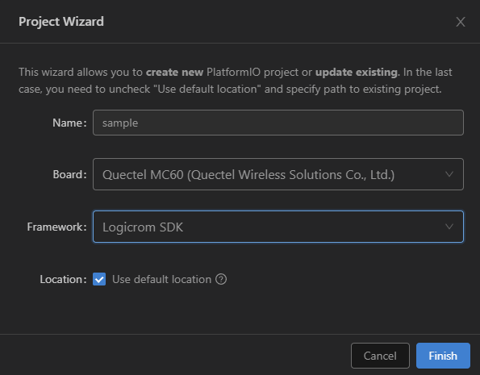
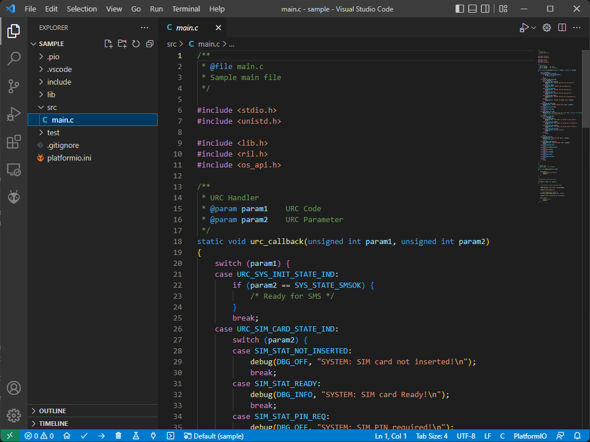
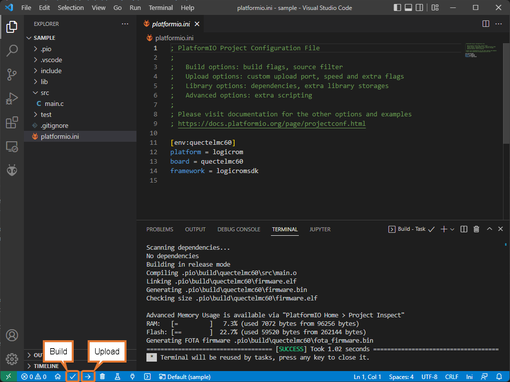

Creating Project in PlatformIO using Logicrom OpenCPU SDK
=========================================================

Setting Up the Project
----------------------

1. Go to "Projects" from PlatformIO Home and click "Create New Project" button.

.. image:: ../../_static/platformio-ide-new-project.png
    :group: logicromsdk
    :title: Create New Project

2. Configure Project settings:
   * Name: Name of project
   * Board: Select board from dropdown
   * Framework: Select from "logicromsdk" frameworks
   * Location: To use custom location, un-check "Use default location" and select project folder.
   * Click finish to create project.

3. Open ``main.c`` file form ``src`` folder. It is default sample source with a sample hello world
   task.

1. Build your project with ctrl+alt+b hotkey (see all Key Bindings in “User Guide” section below)
   or using “Build” button on the PlatformIO Toolbar.
   

Serial Port Configuration
-------------------------

To setup serial port for upload and monitor, You can edit project configuration file ``platform.ini``
in project source tree.

.. code-block:: ini

   [env:quectel_mc60]
   platform = logicrom
   board = quectelmc60
   framework = arduino
   
   ; Upload Port
   upload_port = COM1
   upload_speed = 921600 ; Default is 460800
   
   ; Monitor Port
   monitor_port = COM2
   monitor_speed = 115200
   
For advanced configuration settings of ``platform.ini`` Please refer official documentation of PlatformIO:
https://docs.platformio.org/en/latest/projectconf/index.html#projectconf
