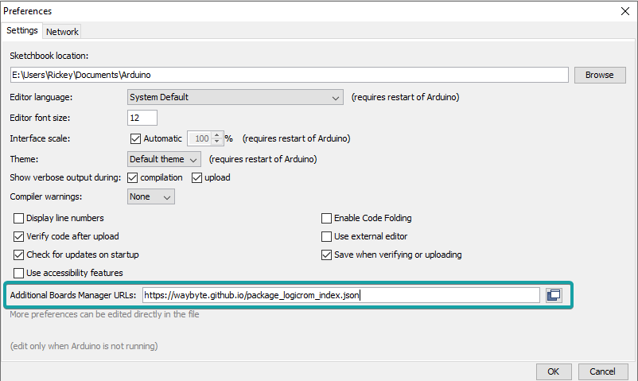
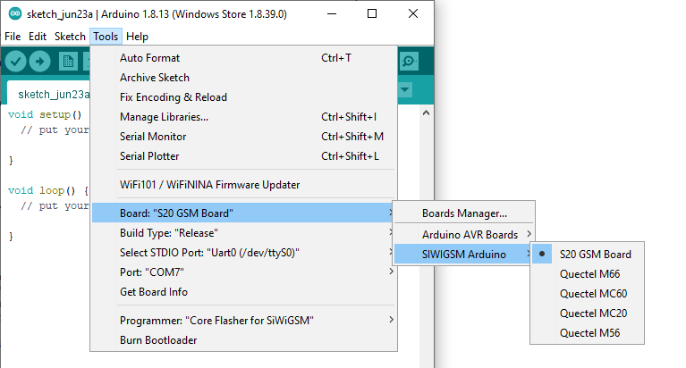

Installing Logicrom on Arduino IDE
**********************************

Arduino IDE
-----------

The open-source Arduino Software (IDE) makes it easy to write code and upload it to the board.
More to read about Arduino IDE:

`Arduino IDE <https://www.arduino.cc/en/main/software>`_

Installing Logicrom Platform
----------------------------

1. Download and Install Arduino IDE from `Arduino website <https://www.arduino.cc/>`_
2. Open Arduino IDE, Go to **File** > **Preferences**
3. Add Logicrom Boards URL to *Additional Board Manager URLs* and click OK.
   ``https://waybyte.github.io/package_logicrom_index.json``
   

4. Go to **Tools** > **Board** > **Board Manager**
5. In search box, type "Logicrom"
6. Click Install button for *Logicrom Arduino Boards*.
7. Select your GSM board from board manager under "Logicrom Arduino"

